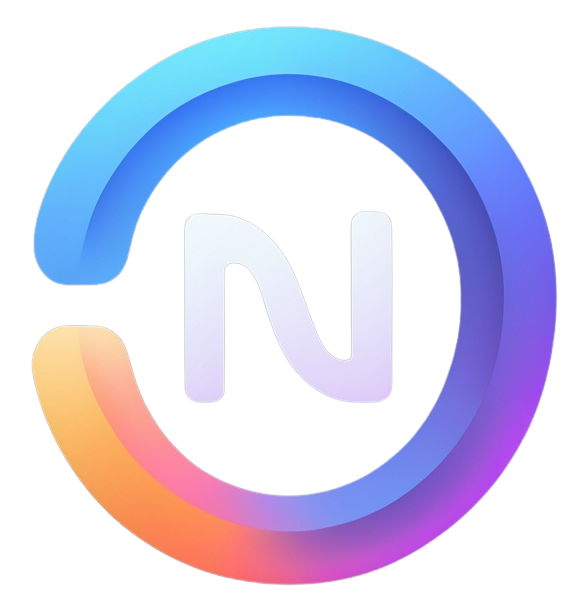

# Nitrate

<div align="center">



**A modern systems programming language compiled to fast native machine code.**

*Written entirely in Rust · LLVM-backed · Cargo-compatible tooling*

</div>

> **Status: active, rapid development.** The compiler pipeline is functional end-to-end — `.nit` sources compile to native executables today — but the language and tooling are still evolving quickly. Expect breaking changes as the design settles.

---

## Table of Contents

- [What is Nitrate?](#what-is-nitrate)
- [Features](#features)
- [A Taste of Nitrate](#a-taste-of-nitrate)
- [Getting Started](#getting-started)
  - [Prerequisites](#prerequisites)
  - [Building from source](#building-from-source)
  - [Your first package](#your-first-package)
  - [Compiling a single file](#compiling-a-single-file)
- [Command-Line Overview](#command-line-overview)
- [Documentation](#documentation)
- [Architecture Overview](#architecture-overview)
  - [Compilation pipeline](#compilation-pipeline)
  - [Core design principles](#core-design-principles)
- [Repository Layout](#repository-layout)
- [Editor Support](#editor-support)
- [Contributing](#contributing)
- [License](#license)

---

## What is Nitrate?

Nitrate is a systems programming language designed for performance-critical software where control over memory and machine code matters. It is compiled ahead-of-time to native code through a sophisticated multi-stage pipeline that ends in LLVM IR.

The project ships two things in one binary:

- **`no3`** — the compiler driver **and** package manager, intentionally drop-in compatible with Rust's `cargo` (same commands, flags, manifest format, and `target/` layout).
- **A built-in LSP server** (`no3 lsp`) for editor integration, alongside an official Visual Studio Code extension pack.

The compiler itself is a Cargo workspace of tightly-scoped crates — lexer, parser, name resolver, HIR, type solver, MIR, borrow checker, and LLVM codegen — each independently testable.

## Features

- **Native compilation via LLVM** — the backend is LLVM 16, giving access to a mature optimizer (levels 0–3) and code emission for multiple targets.
- **Hindley-Milner type inference** — types are inferred through constraint solving with fixed-point iteration; explicit annotations are rarely required.
- **Generics via monomorphization** — generic functions and types are instantiated at compile time with zero runtime overhead and full optimizer visibility.
- **A rich type system** — fixed-width integers (`i8`–`i128`, `u8`–`u128`), floats (`f32`/`f64`), `bool`, `unit`, `never`, target-dependent `usize`; structs (standard & packed), enums (tagged unions), tuples, arrays, **refinement types** (`Refine { base, min, max }`) that carry integer-range bounds, and a reference/pointer family with four permission flavors (`&T`, `&mut T`, `&uniq T`).
- **A MIR mid-level IR with NLL borrow checking** — the validated HIR is lowered to a control-flow-graph-based SSA MIR, then memory-safety-checked by a liveness-driven non-lexical-lifetime borrow checker before codegen.
- **Zero-cost C FFI** — `extern "C"` blocks, `[no_mangle]` attributes, variadic functions, and backtick raw identifiers (`` `for` ``) make interop with C straightforward.
- **Cargo-compatible package manager** — `no3.toml` manifests, `no3.lock` lockfiles, dependencies from registries/paths/git, features, dev- and build-dependencies, publishing, and installing binaries.
- **Structured diagnostics** — errors accumulate across 8 diagnostic groups (scanner → borrow checker) into a `CompilerLog` instead of aborting at the first failure, and each error carries a code you can look up with `no3 --explain <CODE>`.
- **Multiple emission targets** — object files, assembly, LLVM IR text, AST/HIR dumps, and Graphviz DOT exports of MIR control-flow graphs (`--emit-ast`, `--emit-hir`, `--emit-mir`, `--emit-llvmir`, `--emit-asm`, `--emit-obj`).
- **Editor support** — an official VS Code extension pack (syntax highlighting, language server, theme) lives in `extensions/`.

## A Taste of Nitrate

Here is a complete program that compiles and runs today. The standard library is not implemented yet, so it calls the C runtime directly through FFI to print its output:

```nit
// Call into the C standard library.
extern "C" {
    fn [no_mangle] printf(format: *const u8, ...) -> i32;
}

// A generic struct, monomorphized per instantiation.
struct Point<T> {
    pub x: T,
    pub y: T,
}

// A generic constructor with a type parameter.
fn make_point<T>() -> Point<T> {
    Point { x: 10 as T, y: 20 as T }
}

// The program entry point — exported with its real name.
extern "C" fn [no_mangle] main() {
    let p = make_point::<i32>();
    printf("x: %d\ny: %d\n\0", p.x, p.y);
}
```

```
$ no3 compile main.nit -o main && ./main
x: 10
y: 20
```

## Getting Started

### Prerequisites

- The Rust toolchain (stable; the workspace uses edition 2024)
- **LLVM 16** development libraries (the codegen backend links against LLVM via `inkwell`)
- A C/C++ compiler and `cmake` for LLVM linkage

### Building from source

```bash
git clone git@github.com:nitrate-lang/nitrate.git
cd nitrate
cargo build --release
```

The `no3` binary is produced at `target/release/no3`. Run the test suite with `cargo test`.

### Your first package

```bash
no3 new hello
cd hello
no3 run        # build and execute the package
```

`no3 new` scaffolds a package with a `no3.toml` manifest, a `src/entry.nit` source file, a `.gitignore`, and a README — mirroring `cargo new`. `no3 build` produces artifacts in `target/debug/` or `target/release/`.

> **Note:** the scaffolded template imports from `std::io`, but the standard library is still being implemented. Until it lands, use the [FFI-based example above](#a-taste-of-nitrate) as a template for runnable programs.

### Compiling a single file

No manifest? `no3 compile` is Nitrate's `rustc`/`gcc` equivalent — it compiles one `.nit` file with no project scaffolding:

```bash
no3 compile src/main.nit -o main
```

Use `--emit-llvmir`, `--emit-asm`, or `--emit-mir` to inspect the intermediate representations, or `--check` to type-check without emitting anything.


## Command-Line Overview

| Command                 | Description                                                        |
| ----------------------- | ------------------------------------------------------------------ |
| `no3 new` / `no3 init`  | Create a new package (or initialize an existing directory)         |
| `no3 build`             | Compile the current package into `target/`                         |
| `no3 run`               | Build and run a binary, forwarding trailing args                   |
| `no3 check`             | Analyze the package without producing object files                 |
| `no3 test` / `no3 bench`| Build and run the package's test / benchmark binaries              |
| `no3 compile <FILE>`    | Compile a single `.nit` file without a manifest                    |
| `no3 add` / `no3 remove`| Add / remove dependencies in `no3.toml`                            |
| `no3 update`            | Rewrite `no3.lock` to the latest matching versions                 |
| `no3 search` / `no3 publish` | Search the registry / publish a package                        |
| `no3 install` / `no3 uninstall` | Install / remove Nitrate binaries                          |
| `no3 clean`             | Remove build artifacts                                             |
| `no3 doc`               | Build documentation for the package and its dependencies           |
| `no3 lex` / `no3 parse` | Debug modes that print the token stream / parse tree of a file     |
| `no3 demangle <SYMBOL>` | Decode a Nitrate-mangled symbol name                               |
| `no3 lsp`               | Run the built-in language server                                   |

Global options include `-v/--verbose`, `-q/--quiet`, `--color`, `-C <DIR>` (change directory), `--locked` / `--offline` / `--frozen`, `--config KEY=VALUE`, and `--explain <CODE>` for detailed diagnostics explanations.

## Documentation

The [`docs/`](docs/) directory holds 22 in-depth reference documents covering every subsystem of the compiler — a complete index is maintained in [`AGENTS.md`](AGENTS.md). Suggested entry points:

| Document | Covers |
| -------- | ------ |
| [OVERVIEW.md](docs/OVERVIEW.md) | High-level architecture, pipeline stages, and core design principles |
| [TRANSLATION.md](docs/TRANSLATION.md) | Pipeline orchestration and stage sequencing |
| [HIR.md](docs/HIR.md) | The High-Level Intermediate Representation and TLS-based store |
| [TYPE_SYSTEM.md](docs/TYPE_SYSTEM.md) | All type variants, memory layouts, and classification rules |
| [SOLVER.md](docs/SOLVER.md) | Type constraint solving and refinement bounds |
| [MIR.md](docs/MIR.md) | The MIR: basic blocks, SSA locals, places/operands/rvalues |
| [LLVM_CODEGEN.md](docs/LLVM_CODEGEN.md) | MIR → LLVM IR translation and type mapping |
| [DRIVER.md](docs/DRIVER.md) | The `no3` CLI, package manager, and compiler invocation |


## Architecture Overview

### Compilation pipeline

Compilation is a sequence of typed stage transitions — each stage consumes the previous one and exposes only valid next steps (enforced by Rust's type system in `src/translation/src/pipeline.rs`):

```
Source ──lex()──► Tokenized ──parse()──► Parsed ──lower_hir()──► HirLowered
                                                                      │ optimize_hir()
                                                                      ▼
                                                               HirOptimized
                                                                      │ validate()
                                                                      ▼
                                                              HirValidated
                                                                      │ mangle()
                                                                      ▼
                                                               HirMangled
                                                                      │ lower_mir()  (+ NLL borrow check)
                                                                      ▼
                                                               MirLowered
                                                                      │ optimize_mir() / codegen()
                                                                      ▼
                                                             LlvmGenerated
                                                                      │ optimize_llvm()
                                                                      ▼
                                                              LlvmOptimized
                                                                      │ emit_obj() / dump_llvm_ir() / dump_asm()
                                                                      ▼
                                                                Emitted (.o, .s, .ll)
```

The stages in brief:

1. **Lexical analysis** — source bytes become an `AnnotatedToken` stream (maximal munch, backtick raw identifiers, multi-byte UTF-8-aware positions).
2. **Syntactic parsing** — hand-written recursive descent with precedence climbing builds the Parse Tree AST.
3. **Name resolution & HIR lowering** — imports and paths are resolved into a `SymbolTab`, then the AST is lowered into the interned HIR store.
4. **Type inference & solving** — Hindley-Milner constraint solving runs to a fixed point, monomorphizing generic instantiations along the way.
5. **HIR optimization & validation** — pluggable HIR passes run, then a semantic pass produces a `ValidHir<Module>` (a type-level guarantee of correctness).
6. **Name mangling** — every symbol gets a deterministic, self-delimiting LLVM linkage name.
7. **MIR lowering & borrow checking** — the validated HIR is flattened into a CFG-based SSA MIR and checked by the NLL borrow checker.
8. **LLVM codegen & optimization** — MIR maps 1:1 to LLVM IR, which is then optimized and emitted as an object file, assembly, or IR text.

### Core design principles

Four principles shape the entire codebase (detailed in [OVERVIEW.md](docs/OVERVIEW.md)):

1. **Immutable interning with thread-local storage** — types and literals are interned and deduplicated behind a TLS-backed `Store`, so handle equality *is* structural equality in O(1). Mutable items live in append-only, interior-mutable cells for solver-time updates.
2. **Diagnostic accumulation** — every stage reports into a shared `CompilerLog` rather than aborting at the first error, so one compile shows all issues.
3. **Pass-based pipeline with fixed-point iteration** — compilation phases are standalone passes; inference-style passes iterate until reaching a fixed point.
4. **Reentrant store access** — handles dereference through TLS, eliminating lifetime parameters and enabling store access from any scope.

## Repository Layout

```
nitrate/
├── src/
│   ├── bin/                    # Binaries: no3 (CLI), nitrate_gen (program fuzzer generator)
│   ├── lib.rs                  # Public crate re-exports
│   ├── diagnosis/              # nitrate_diagnosis — CompilerLog, error codes, caret rendering
│   ├── driver/                 # nitrate_driver — no3 subcommands, package manager, LSP server
│   ├── generate/               # nitrate_generate — random .nit generator for compiler testing
│   └── translation/            # nitrate_translation — the compilation pipeline
│       └── src/
│           ├── token_lexer/    # Lexer
│           ├── tree_parse/     # Parser
│           ├── tree_resolve/   # Name resolution
│           ├── hir/            # HIR types, interning, and TLS store
│           ├── hir_from_tree/  # AST → HIR lowering
│           ├── hir_solve/      # Type inference & monomorphization
│           ├── hir_validate/   # Semantic validation (ValidHir<T>)
│           ├── hir_mangle/     # Name mangling
│           ├── hir_evaluate/   # Constant evaluation
│           ├── mir/            # MIR types (basic blocks, SSA locals)
│           ├── mir_from_hir/   # HIR → MIR lowering
│           ├── mir_borrow_check/ # NLL borrow checker
│           ├── llvm/           # LLVM context wrapper & optimizer
│           └── llvm_from_mir/  # MIR → LLVM IR codegen
├── docs/                       # 22 in-depth compiler reference documents
├── extensions/                 # VS Code extension pack, syntax grammar, LSP client
├── tests/                      # End-to-end compile-and-run integration tests
└── Cargo.toml                  # Workspace manifest (LLVM 16 / inkwell 0.6)
```


## Editor Support

- **VS Code extension pack** — [`extensions/vscode/nitrate`](extensions/vscode/nitrate) bundles syntax highlighting ([`nitrate-syntax`](extensions/vscode/nitrate-syntax)), a language server client ([`nitrate-lsp`](extensions/vscode/nitrate-lsp)), and iconography.
- **Language server** — `no3 lsp` speaks the Language Server Protocol, providing document synchronization, diagnostics, and completion.
- **CLI debugging** — inspect any stage of compilation with `no3 lex`, `no3 parse`, `no3 compile --emit-ast|--emit-hir|--emit-mir|--emit-llvmir|--emit-asm`, and `no3 demangle`.

## Contributing

Contributions are welcome! The repo contains a complete documentation index ([`AGENTS.md`](AGENTS.md)) that doubles as an orientation guide for new contributors. The `docs/` folder is the authoritative reference for every subsystem.

A few pointers:

- Each compiler stage lives in its own crate with its own test suite — run `cargo test -p <crate>` to test a single stage.
- The compiler accumulates diagnostics rather than failing fast; new errors should follow the structured `CompilerLog` patterns in `src/diagnosis/`.
- The codebase adheres to the architectural principles in [OVERVIEW.md](docs/OVERVIEW.md) — in particular, handle-based access to TLS-stored data, and pass-based pipelines with fixed-point iteration.
- `no3 compile` + `--emit-*` flags are the fastest way to inspect how a change affects each IR.

## License

Nitrate is licensed under the [GNU Lesser General Public License v2.1](LICENSE.md).

